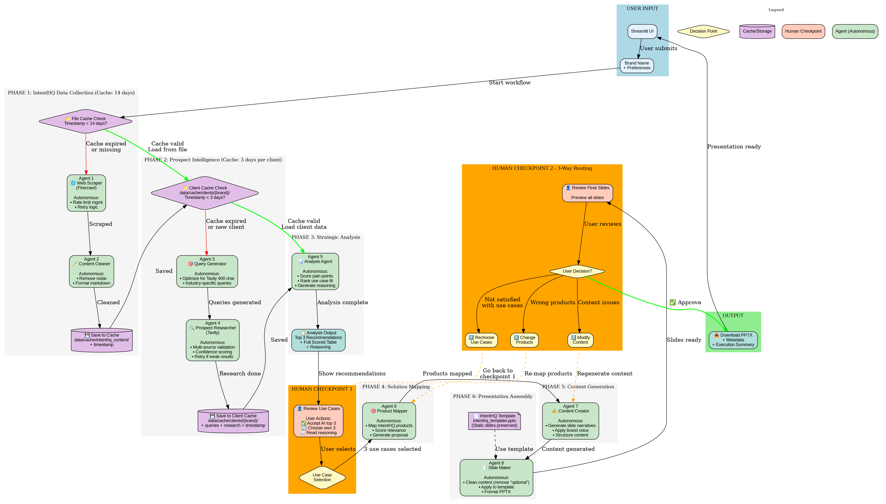

# IntentHQ Presentation Generator

Autonomous AI system that generates tailored sales presentations using 8 intelligent agents orchestrated with LangGraph.

##  Architecture



### Architecture Flow
[USER INPUT] Brand Name

[PHASE 1: INTENTHQ - File Cache, 14 days]
├─ Check if cache valid (< 14 days old)
├─ If valid → Load from cache
├─ If expired:
│   ├─ Agent 1: Scraper (Firecrawl)
│   ├─ Agent 2: Cleaner
│   └─ Save to cache with timestamp

[PHASE 2: PROSPECT INTEL - File Cache, 3 days per client]
├─ Check if client cache exists & valid (< 3 days)
├─ If valid → Load from cache
├─ If expired or new client:
│   ├─ Agent 3: Query Generator (Tavily 400 char optimization)
│   ├─ Agent 4: Prospect Research (Tavily search)
│   └─ Save to cache/clients/{brand_name}/

[PHASE 3: ANALYSIS]
├─ Agent 5: Analysis Agent (scores pain points & use cases)
└─ Output: Top 3 recommendations + full scored table

[HUMAN CHECKPOINT 1] ⚠️ REQUIRED
├─ User reviews recommendations
└─ Selects 3 use cases

[PHASE 4: SOLUTION MAPPING]
└─ Agent 6: Product Mapper (maps products to selected use cases)

[PHASE 5: CONTENT GENERATION]
└─ Agent 7: Content Creator (generates content with your prompts)

[PHASE 6: SLIDE ASSEMBLY]
└─ Agent 8: Slide Maker (cleans content, uses your template PPTX)

[HUMAN CHECKPOINT 2] ⚠️ REQUIRED
├─ User reviews final slides
└─ Chooses:
    ├─ ✅ Approve → Download
    ├─ 1️⃣ Rechoose use cases → Back to Checkpoint 1
    ├─ 2️⃣ Change products → Back to Agent 6
    └─ 3️⃣ Modify content → Back to Agent 7

[OUTPUT] Download PPTX

### System Components

- **8 Autonomous Agents**: Each with reasoning and decision-making
- **2 Human Checkpoints**: Strategic validation points
- **File-based Cache**: 14-day IntentHQ cache, 3-day client cache
- **LangGraph Orchestration**: State management and routing
- **Streamlit UI**: Real-time monitoring and interaction

## 🚀 Quick Start

### Prerequisites

- Python 3.10+
- OpenAI API key
- Firecrawl API key
- Tavily API key

### Installation
```bash
# Clone repository
git clone <your-repo-url>
cd intenthq-presentation-generator

# Create virtual environment
python -m venv venv
source venv/bin/activate  # Windows: venv\Scripts\activate

# Install dependencies
pip install -r requirements.txt

# Or with UV
uv sync

# Setup environment
cp .env.example .env
# Edit .env with your API keys
```

### Run Application
```bash
# Start Streamlit UI
streamlit run ui/streamlit_app.py

# Or with UV
uv run streamlit run ui/streamlit_app.py
```

## 📋 Usage

1. **Enter prospect company name** (e.g., "Nike", "Barclays")
2. **Review use case recommendations** at Checkpoint 1
3. **Select 3 use cases** to focus on
4. **Review final presentation** at Checkpoint 2
5. **Choose action**:
   - ✅ Approve & Download
   - 1️⃣ Rechoose use cases
   - 2️⃣ Change products
   - 3️⃣ Modify content
6. **Download PPTX**

## Agent Overview

| Agent | Purpose | Key Feature |
|-------|---------|-------------|
| Scraper | Extract IntentHQ content | Rate limit handling |
| Cleaner | Process and organize data | Markdown cleaning |
| Query Generator | Create Tavily queries | 400 char optimization |
| Researcher | Gather prospect intel | Multi-source validation |
| Analyst | Score use cases | Pain point ranking |
| Product Mapper | Match products to needs | Capability scoring |
| Content Creator | Generate narratives | Brand voice adherence |
| Slide Maker | Assemble PPTX | Template-based |

## Project Structure

intenthq-presentation-generator/
├── config/          # Configuration and prompts
├── src/             # Source code
│   ├── agents/      # 8 agent implementations
│   ├── graph/       # LangGraph workflow
│   ├── state/       # State schemas
│   ├── tools/       # External API wrappers
│   └── cache/       # Cache management
├── ui/              # Streamlit interface
├── data/            # Templates and cache
└── tests/           # Test suite

## Testing
```bash
# Run all tests
pytest

# Run specific test file
pytest tests/test_agents.py

# With coverage
pytest --cov=src tests/
```

## Configuration

Edit `.env` to customize:

- **API Keys**: OpenAI, Firecrawl, Tavily
- **Cache TTL**: IntentHQ (14 days), Clients (3 days)
- **Model Settings**: GPT-5.2, temperature
- **Paths**: Data, cache, outputs

## Cache Management

### IntentHQ Content Cache
- **Location**: `data/cache/intenthq_content/`
- **TTL**: 14 days
- **Refresh**: Automatic when expired

### Client Research Cache
- **Location**: `data/cache/clients/{brand_name}/`
- **TTL**: 3 days
- **Purpose**: Enable rework without re-scraping

## Customization

### Add Custom Prompts
Edit files in `config/prompts/` to customize agent behavior.

### Modify Template
Replace `data/templates/intenthq_template.pptx` with your branded template.

### Adjust Workflow
Modify `src/graph/workflow.py` to change agent flow.

## 📝 Development

### Code Style
```bash
# Format code
black src/ ui/ tests/

# Type checking
mypy src/
```

### Adding New Agent
1. Create agent file in `src/agents/`
2. Inherit from `BaseAgent`
3. Add to workflow in `src/graph/workflow.py`
4. Update routing logic if needed

## 🐛 Troubleshooting

### Issue: Cache not working
**Solution**: Check timestamps in `.timestamp` files

### Issue: Tavily rate limit
**Solution**: Adjust `TAVILY_MAX_RESULTS` in `.env`

### Issue: PPTX template not found
**Solution**: Ensure `intenthq_template.pptx` exists in `data/templates/`
